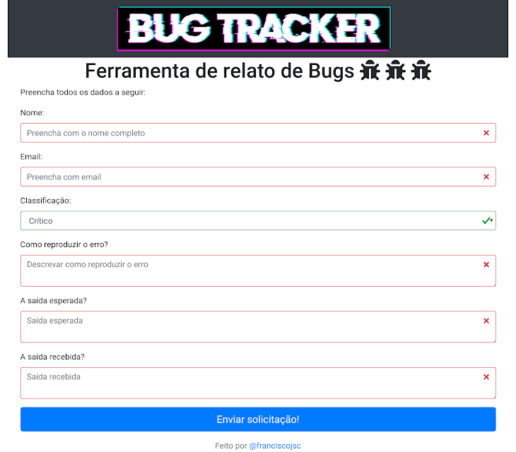

# :tada: BUG TRACKER :tada:

Aplicação para relatos de bugs - Desenvolvido durante o FullStack Lab do [DevPleno](https://www.devpleno.com).

## Captura de tela :camera:



## Pré-requisitos :computer:

[NodeJS](https://nodejs.org/en/)  
[Planilha google](https://www.google.com/intl/pt-BR/sheets/about/)  
[Google App Script](https://www.google.com/script/start/)

## Configurações :wrench:

Crie uma [planilha google](new.sheets) em branco. Pegue o id da planilha que está na url, por exemplo:

```
https://docs.google.com/spreadsheets/d/14q_AE9P8bRvanks7rO08FmRs-urxG6C0bhOwRTTTTI/edit#gid=0
```

O id da planilha seria `14q_AE9P8bRvanks7rO08FmRs-urxG6C0bhOwRTTTTI`.

Acesse o [Script do Google](https://script.google.com/home), crie um novo projeto, adicione o código abaixo, e na primeira linha coloque o id da planilha no campo correspondente.

```js
var planilha = SpreadsheetApp.openById("coloque aqui o id da planilha");
var sheet = planilha.getActiveSheet();

function doGet(e) {
  
  var linhaInicial = e.parameter.InitLine
  var colunaInicial = e.parameter.InitColumn
  var numLinhas = e.parameter.numberLine
  var numColunas = e.parameter.numberColumn

  if(numLinhas > 1000 || numColunas > 10) {
      return ContentService.createTextOutput('Máximo de 1000 linhas e 10 colunas por requisição');
  }
  
  var content = sheet.getRange(linhaInicial, colunaInicial, numLinhas, numColunas).getValues();

  Logger.log(content);
  
  return ContentService.createTextOutput(JSON.stringify(content)).setMimeType(ContentService.MimeType.JSON); 
                                         
}

function doPost(e) {
  
  var linhas = sheet.getLastRow();
  var name = e.parameter.name;
  var email = e.parameter.email;
  var issueType = e.parameter.issueType;
  var howToReproduce = e.parameter.howToReproduce;
  var expectedOutput = e.parameter.expectedOutput;
  var receivedOutput = e.parameter.receivedOutput;
  var source = e.parameter.source;
  var userAgent = e.parameter.userAgent;
  var userDate= e.parameter.userDate;
  
  Logger.log(linhas + " " 
             + name + " " 
             + email + " " 
             + issueType + " " 
             + howToReproduce + " " 
             + expectedOutput + " " 
             + receivedOutput + " "
             + source + " "
             + userAgent + " " 
             + userDate );
  
  sheet.appendRow([linhas, name, email, issueType, howToReproduce, expectedOutput, receivedOutput, source, userAgent, userDate]);  
  
  return ContentService.createTextOutput("Created");
    
}
```

Crie uma versão para o projeto, após realize a publicação do projeto como aplicativo da web, será retornado uma url do aplicativo.

Na máquina local, realize o clone do projeto:
```bash
git clone https://github.com/franciscojsc/bug-tracker.git
```

Entre na pasta:
```bash
cd bug-tracker
```

Crie um arquivo `.env` e adicione a variável de ambiente com a url para o seu projeto do [Google App Script](https://developers.google.com/apps-script), substituindo o valor correspondente:
```
PLANILHA_GOOGLE=seu-link-para-o-app-script
```

## Executando :rocket:

Instale as dependências:
```bash
npm install
```

Inicie o aplicativo:
```bash
npm start
```

Acesse o aplicativo em `http://localhost:3000`.

## Licença :memo:

Este projeto está licenciado sob a licença MIT - Consulte o arquivo [LICENSE](LICENSE) para obter detalhes.

